# 📖 دليل حالات الاستخدام ومسارات العمل الشاملة لمنصة «أنيس»
> **وثيقة معمارية وتشغيلية متكاملة لجميع أدوار ومسارات النظام (Happy Paths & Edge Cases)**  
> المنصة: **أنيس (Anees) لرعاية ومساعدة كبار السن**  
> تاريخ الإصدار: **أكتوبر 2026**

---

## 📑 فهرس المحتويات
1. [نظرة عامة على أدوار النظام والمسؤوليات](#1-نظرة-عامة-على-أدوار-النظام-والمسؤوليات)
2. [المسار 1: التسجيل والدخول والتحقق (Authentication & Onboarding)](#2-المسار-1-التسجيل-والدخول-والتحقق)
3. [المسار 2: طالب الخدمة (المستفيد / كبير السن) — المسار القياسي](#3-المسار-2-طالب-الخدمة-المستفيد--كبير-السن)
4. [المسار 3: مقدم الخدمة (المتطوع) — المسار القياسي](#4-المسار-3-مقدم-الخدمة-المتطوع)
5. [المسار 4: لوحة الإدارة والرقابة المركزية (Super Admin)](#5-المسار-4-لوحة-الإدارة-والرقابة-المركزية)
6. [المسارات الاستثنائية والطارئة (Edge & Exception Flows)](#6-المسارات-الاستثنائية-والطارئة)
   - [أ) مسار التأخير في الحضور (Volunteer Delay Flow)](#أ-مسار-التأخير-في-الحضور-volunteer-delay-flow)
   - [ب) مسار الاعتذار بعد قبول المهمة (Apology & Re-queue Flow)](#ب-مسار-الاعتذار-بعد-قبول-المهمة-apology--re-queue-flow)
   - [ج) مسار طلب متطوع بديل (Search Alternative Provider)](#ج-مسار-طلب-متطوع-بديل-search-alternative-provider)
   - [د) مسار إعادة الجدولة (Reschedule Request)](#د-مسار-إعادة-الجدولة-reschedule-request)
   - [هـ) مسار إلغاء الطلب (Cancellation Flow)](#هـ-مسار-إلغاء-الطلب-cancellation-flow)
   - [و) مسار الإبلاغ عن مشكلة والشكاوى (Dispute & Complaint Resolution)](#و-مسار-الإبلاغ-عن-مشكلة-والشكاوى-dispute--complaint-resolution)
   - [ز) مسار رفض أو تعليق الحساب (Rejection & Suspension Flow)](#ز-مسار-رفض-أو-تعليق-الحساب-rejection--suspension-flow)
7. [جدول مطابقة المسارات البرمجية (Routes & Permissions Matrix)](#7-جدول-مطابقة-المسارات-البرمجية)

---

## 1. نظرة عامة على أدوار النظام والمسؤوليات

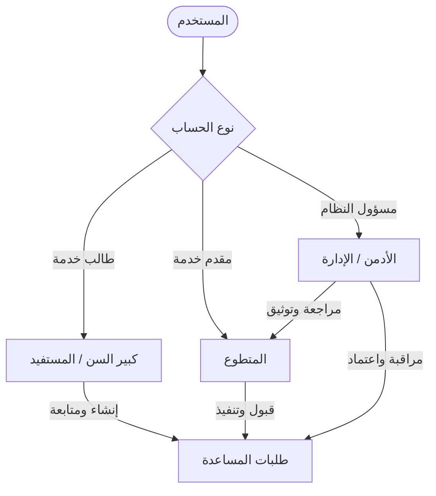
```mermaid
flowchart TD
    User([المستخدم]) --> Choice{نوع الحساب}
    Choice -->|طالب خدمة| Elder[كبير السن / المستفيد]
    Choice -->|مقدم خدمة| Volunteer[المتطوع]
    Choice -->|مسؤول النظام| Admin[الأدمن / الإدارة]

    Elder -->|إنشاء ومتابعة| Req[طلبات المساعدة]
    Volunteer -->|قبول وتنفيذ| Req
    Admin -->|مراقبة واعتماد| Req
    Admin -->|مراجعة وتوثيق| Volunteer
```

| الدور | المسؤولية الأساسية | الصلاحيات المحمية |
| :--- | :--- | :--- |
| **طالب الخدمة (كبير السن)** | طلب المساعدة في شؤون الحياة اليومية (أدوية، تسوق، مرافقة، مساعدة منزلية). | إنشاء طلبات، تقييم المتطوعين، إلغاء الطلب، تقديم الشكاوى. |
| **مقدم الخدمة (المتطوع)** | خدمة كبار السن وتقديم العون الميداني وتوثيق ساعات التطوع. | استعراض وقبول المهام، تحديث حالة الخدمة، الإبلاغ عن تأخير أو اعتذار، طلب شهادات خبرة. |
| **مدير النظام (Admin)** | الحوكمة والأمان والجودة وضمان سلامة كبار السن. | تدقيق الوثائق، اعتماد المتطوعين، مراقبة الطلبات، البت في النزاعات، مراجعة سجلات الأمان. |

---

## 2. المسار 1: التسجيل والدخول والتحقق

### 2.1 شاشة اختيار نوع الحساب (`/register`)
يتيح الموقع شاشة واضحة وبسيطة تمكن المستخدم من تحديد دوره: هل هو مسن بحاجة لعون أم متطوع يرغب بالتقديم.

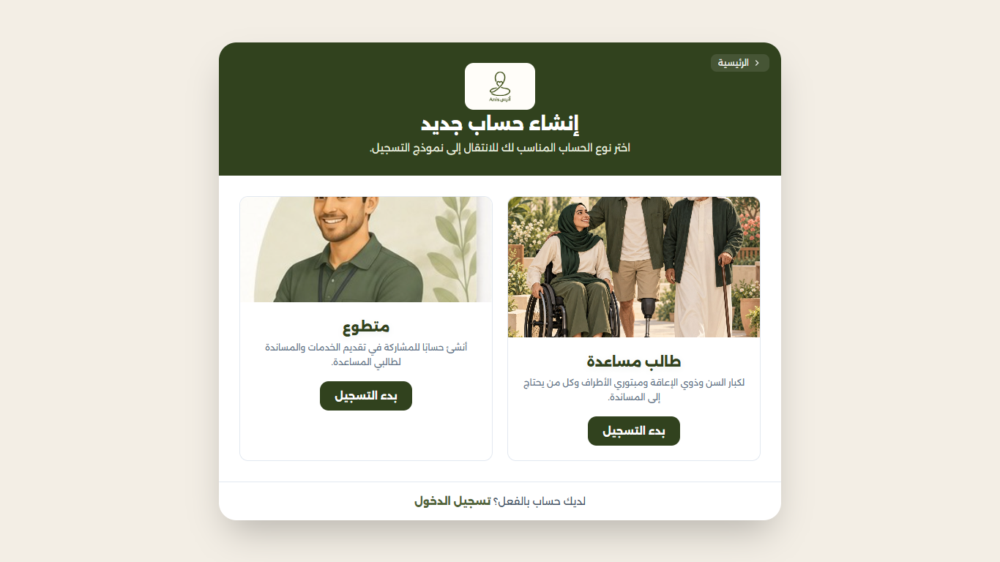

---

### 2.2 تسجيل طالب الخدمة (`/frontend/elderly/register`)
- **الحقول:** الاسم الكامل، البريد الإلكتروني، رقم الهاتف، المدينة، كلمة المرور، الصورة الشخصية.
- **التجربة:** حقول واضحة بخط كبير ومناسب وسهل القراءة لكبار السن.

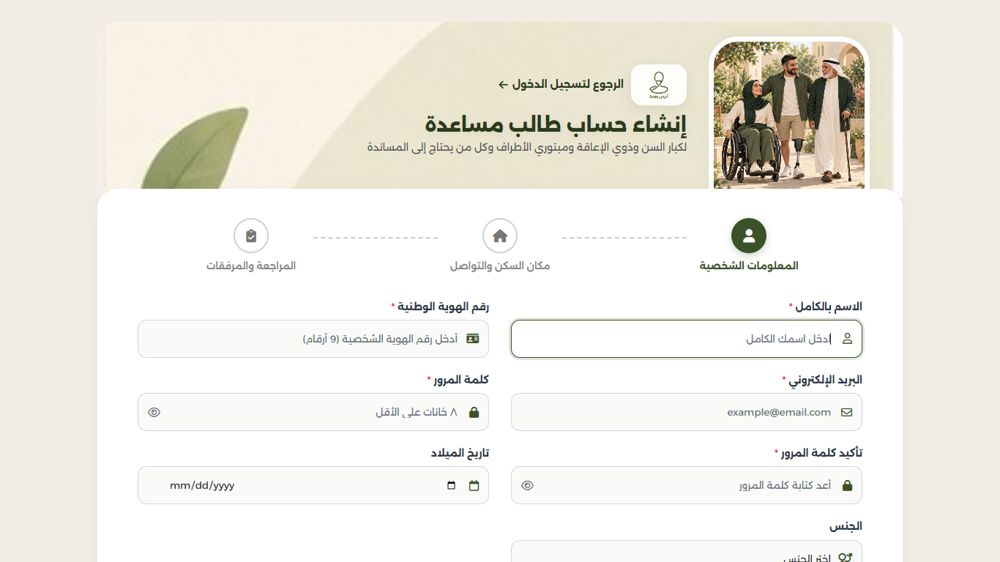

---

### 2.3 تسجيل المتطوع ورفع الوثائق (`/frontend/volunteer/register`)
- **الحقول المطلوبة:** الاسم، تاريخ الميلاد (أكبر من 18 عاماً)، الهاتف، صورة الهوية الوطنية، شهادة حسن السيرة والسلوك.
- **الحالة الابتدائية:** يدخل الحساب تلقائياً في حالة `pending` بانتظار مراجعة الإدارة واعتماده لضمان أمان المسنين.

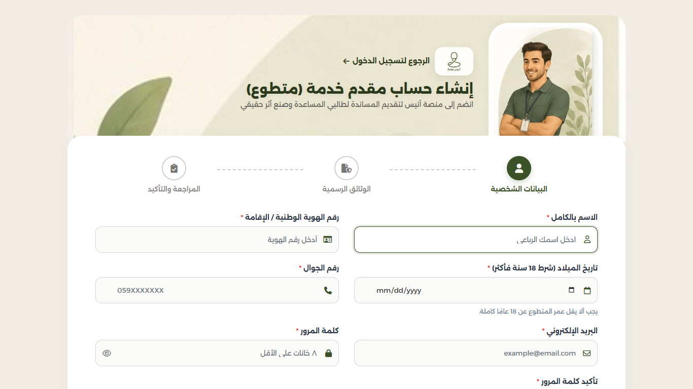

---

### 2.4 تسجيل دخول المستخدمين (`/login`) وتسجيل دخول الإدارة (`/admin/login`)
- تم فصل شاشة دخول الإدارة كلياً لحماية لوحة التحكم.

| شاشة دخول المستخدمين والمتطوعين | شاشة دخول الإدارة المنفصلة |
| :---: | :---: |
| 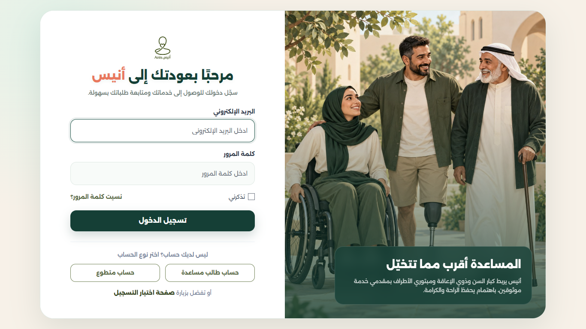 | 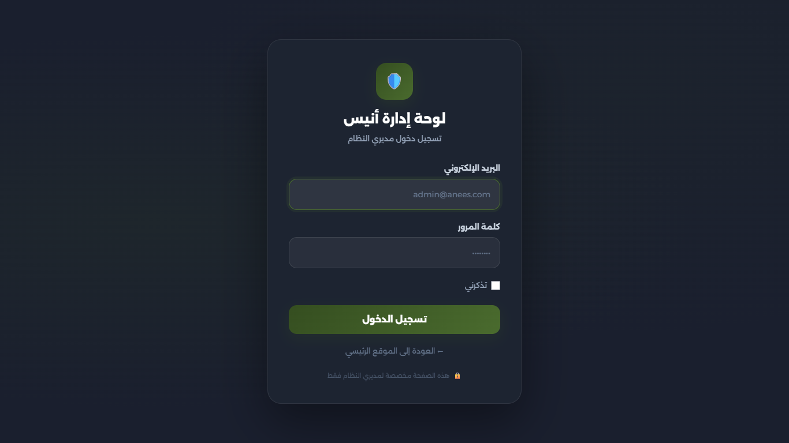 |

---

## 3. المسار 2: طالب الخدمة (المستفيد / كبير السن)

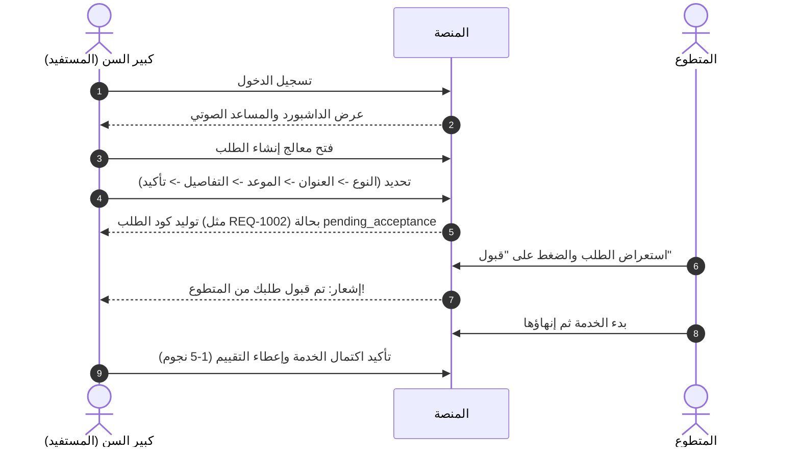
```mermaid
sequenceDiagram
    autonumber
    actor Elder as كبير السن (المستفيد)
    participant App as المنصة
    actor Vol as المتطوع
    
    Elder->>App: تسجيل الدخول
    App-->>Elder: عرض الداشبورد والمساعد الصوتي
    Elder->>App: فتح معالج إنشاء الطلب
    Elder->>App: تحديد (النوع -> العنوان -> الموعد -> التفاصيل -> تأكيد)
    App-->>Elder: توليد كود الطلب (مثل REQ-1002) بحالة pending_acceptance
    Vol->>App: استعراض الطلب والضغط على "قبول"
    App-->>Elder: إشعار: تم قبول طلبك من المتطوع!
    Vol->>App: بدء الخدمة ثم إنهاؤها
    Elder->>App: تأكيد اكتمال الخدمة وإعطاء التقييم (1-5 نجوم)
```

### 3.1 لوحة التحكم والمساعد الصوتي الذكي (`/dashboard`)
تتيح شاشة ترحيبية بخط عريض وأزرار سريعة مع قراءة صوتية مدمجة للتسهيل على كبير السن.

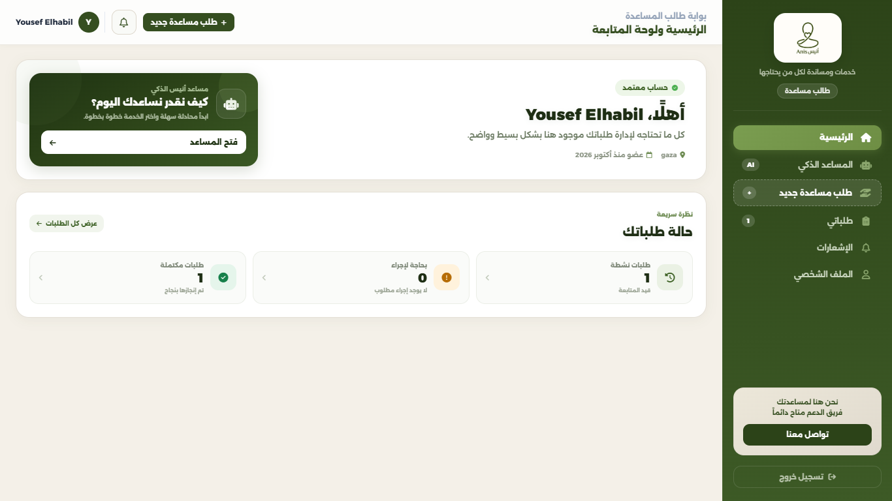

---

### 3.2 معالج إنشاء الطلب (Step-by-Step Wizard)

| المرحلة 1: اختيار الخدمة | المرحلة 2: تحديد الموقع |
| :---: | :---: |
| 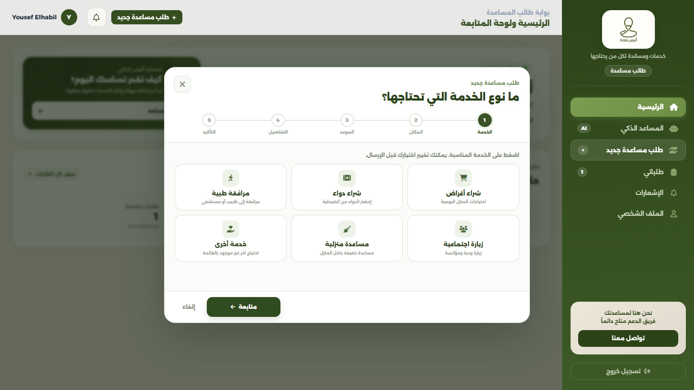 | 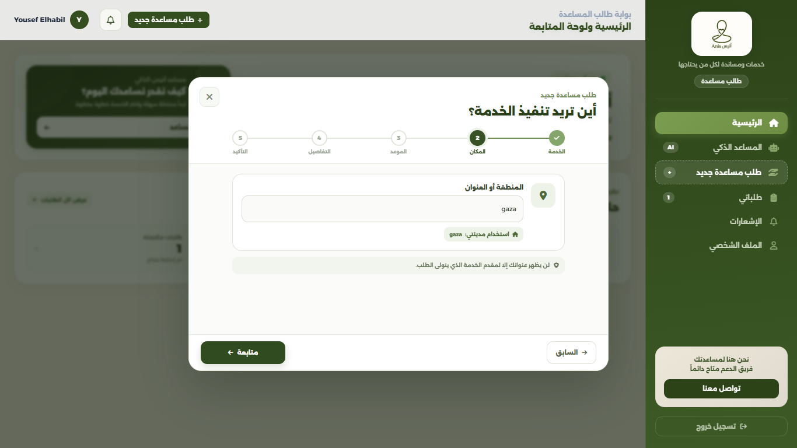 |

| المرحلة 3: تحديد الموعد | المرحلة 4 و 5: المراجعة والتأكيد |
| :---: | :---: |
| 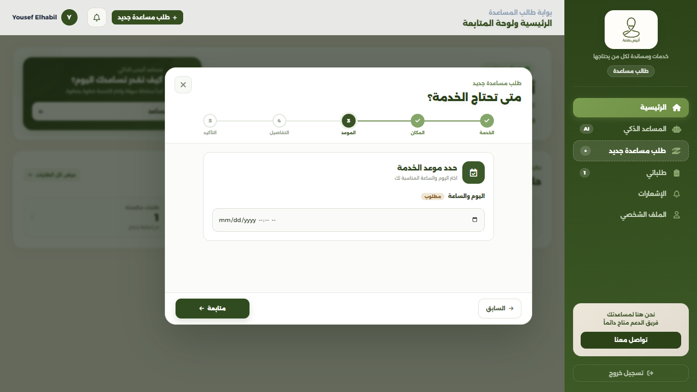 | زر تأكيد محمي ضد النقر المكرر مع توليد رقم تسلسلي `#REQ-XXXX` |

---

### 3.3 إدارة ومتابعة الطلبات (`/requests`)
تتيح لكبير السن تبويبات منظمة:
1. **الطلبات الجارية (Active):** التي تم قبولها وفي انتظار المتطوع.
2. **تحتاج إجراء (Needs Action):** لتأكيد الإنجاز أو التعامل مع التأخير.
3. **المكتملة (Completed):** أرشيف الخدمات السابقة.
4. **الملغاة (Cancelled):** الطلبات التي تم إلغاؤها.

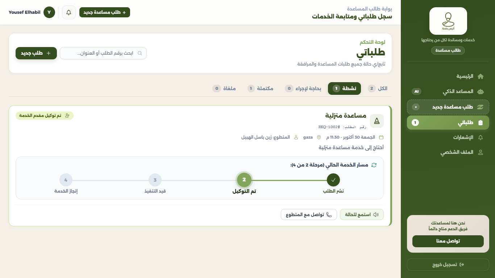

---

### 3.4 الملف الشخصي والإشعارات

| الملف الشخصي وتحديث الصورة | مركز الإشعارات الفورية |
| :---: | :---: |
| 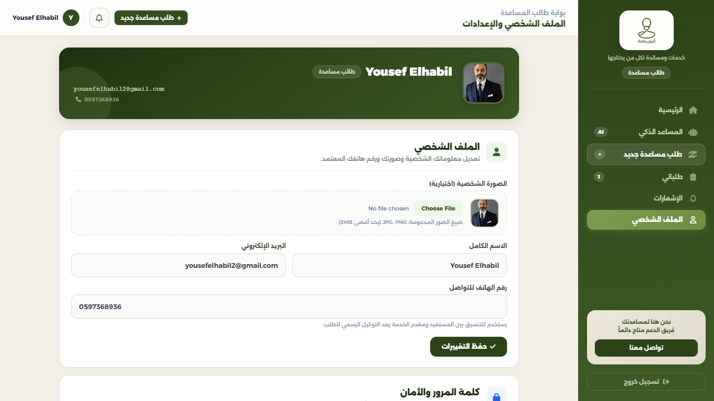 | 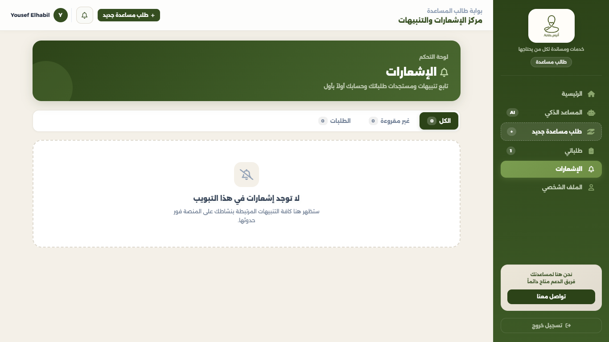 |

---

## 4. المسار 3: مقدم الخدمة (المتطوع)

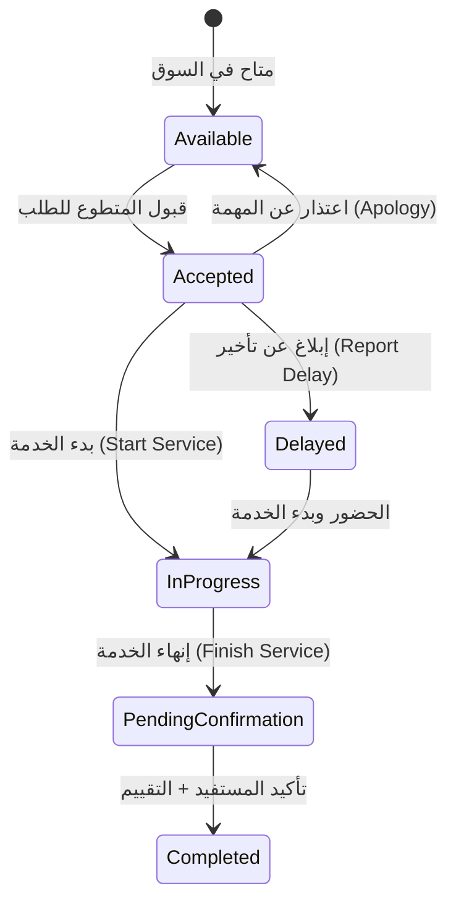
```mermaid
stateDiagram-v2
    [*] --> Available: متاح في السوق
    Available --> Accepted: قبول المتطوع للطلب
    Accepted --> InProgress: بدء الخدمة (Start Service)
    Accepted --> Delayed: إبلاغ عن تأخير (Report Delay)
    Accepted --> Available: اعتذار عن المهمة (Apology)
    Delayed --> InProgress: الحضور وبدء الخدمة
    InProgress --> PendingConfirmation: إنهاء الخدمة (Finish Service)
    PendingConfirmation --> Completed: تأكيد المستفيد + التقييم
```

### 4.1 لوحة تحكم المتطوع (`/provider/dashboard`)
تُبرز للمتطوع إحصائياته: الساعات التطوعية المنجزة، المهام الحالية، ومتوسط التقييم، مع تنبيهات المهام العاجلة.

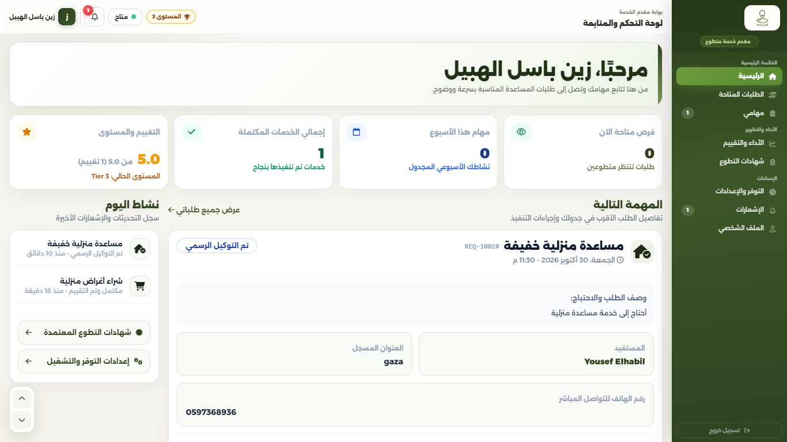

---

### 4.2 استعراض وقبول المهام المتاحة (`/provider/available`)
- تظهر جميع الطلبات المتاحة مع التفاصيل: نوع الخدمة، المدينة أو الحي، والموعد المحدد.
- بضغطة واحدة على **«قبول الطلب»**، يتم قفل الطلب باسم المتطوع وينتقل إلى جدول مهامه.

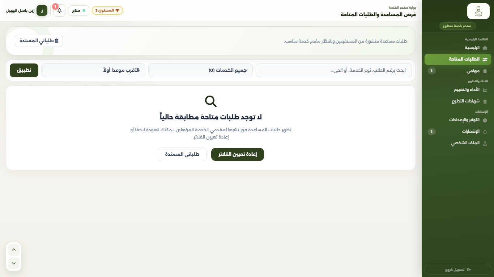

---

### 4.3 شاشة إدارة المهام وإجراءات التنفيذ (`/provider/tasks`)
تحتوي كل بطاقة مهمة مقبولة على الإجراءات التشغيلية التالية:
1. **بدء الخدمة (Start Service):** لتحويل الحالة إلى `in_progress`.
2. **إبلاغ عن تأخير (Report Delay):** لإعلام المسن بأنه سيتأخر مع تحديد السبب.
3. **اعتذار عن المهمة (Apologize):** في حال حدوث ظرف قاهر لإعادة الطلب للنظام.
4. **إبلاغ عن مشكلة (Report Issue):** فتح بلاغ إداري.
5. **إنهاء الخدمة (Finish Service):** عند إتمام المساعدة لتحويلها لتأكيد المسن.

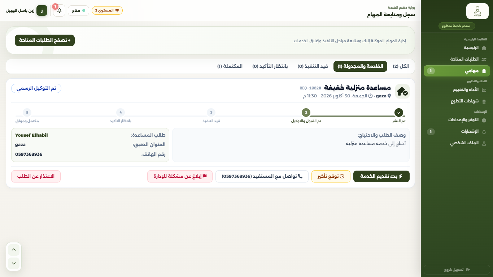

---

### 4.4 سجل الأداء وطلب الشهادات الرسمية

| صفحة الأداء وتقييمات المستفيدين | صفحة طلب شهادات ساعات التطوع المعتمدة |
| :---: | :---: |
| 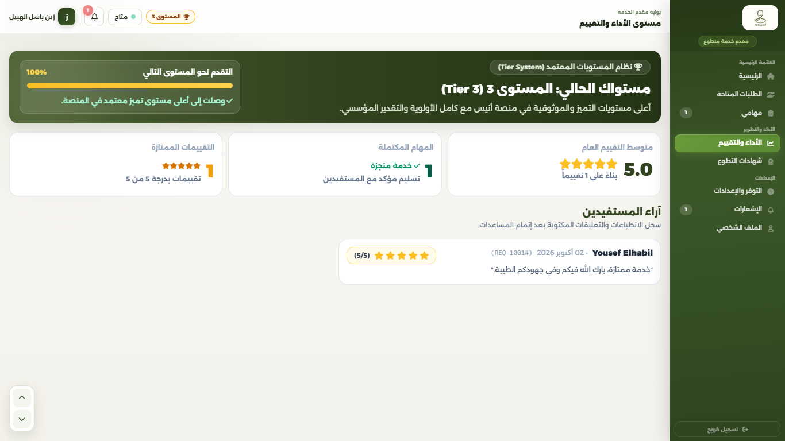 | 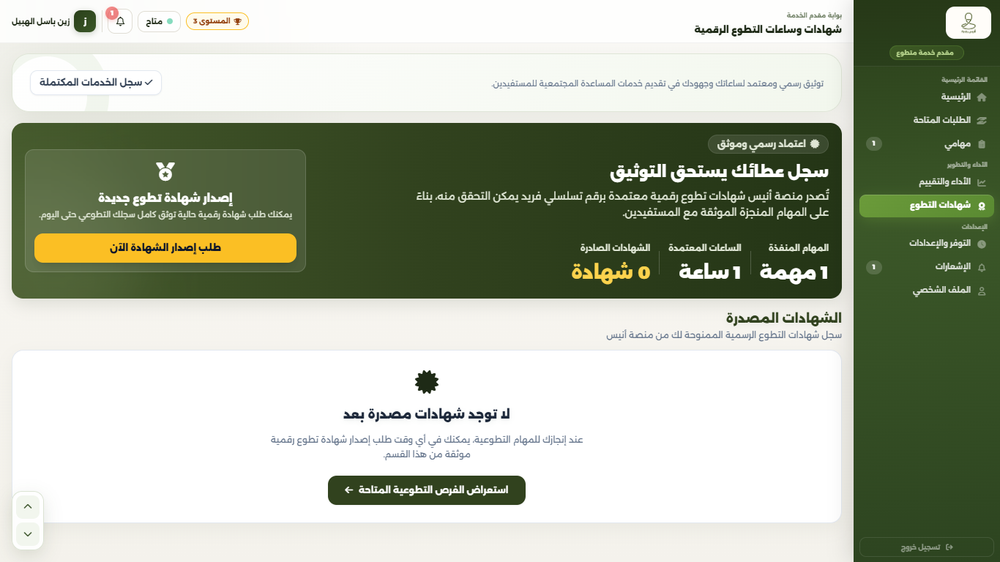 |

---

## 5. المسار 4: لوحة الإدارة والرقابة المركزية (Super Admin)

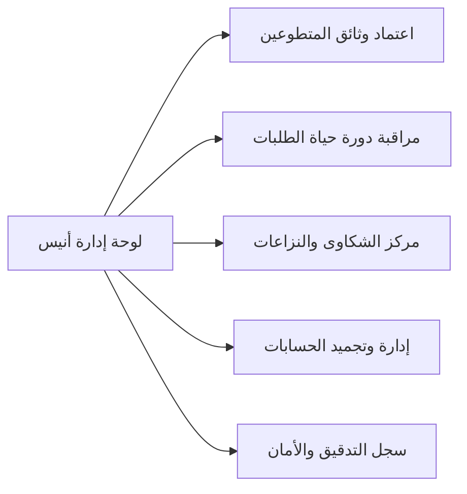
```mermaid
flowchart LR
    AdminPanel[لوحة إدارة أنيس]
    AdminPanel --> Approvals[اعتماد وثائق المتطوعين]
    AdminPanel --> RequestsMon[مراقبة دورة حياة الطلبات]
    AdminPanel --> Complaints[مركز الشكاوى والنزاعات]
    AdminPanel --> UsersMgmt[إدارة وتجميد الحسابات]
    AdminPanel --> AuditLogs[سجل التدقيق والأمان]
```

### 5.1 لوحة الإحصائيات المركزية (`/admin/dashboard`)
شاشة شاملة تعرض نبض المنصة في الوقت الفعلي: عدد المستخدمين، المتطوعين النشطين، الطلبات المكتملة، ونسب الرضا.

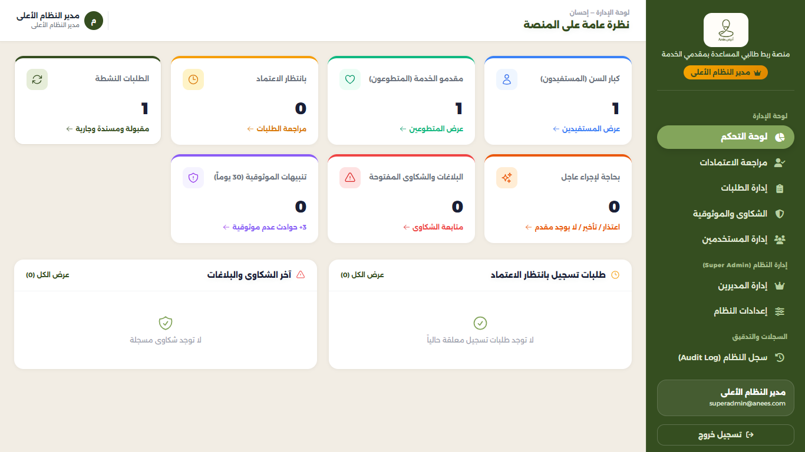

---

### 5.2 اعتماد وثائق المتطوعين الجدد (`/admin/approvals`)
- يستعرض الأدمن طلبات التسجيل المعلقة `pending`.
- يمكن فتح الهوية الشخصية وشهادة السلوك ومراجعتها بوضوح، ثم اتخاذ أحد القرارات:
  - **قبول واعتماد (`Approve`):** تفعيل الحساب فوراً.
  - **رفض (`Reject`):** مع تحديد سبب الرفض.
  - **طلب إعادة رفع الوثائق:** في حال كانت الصورة غير واضحة.

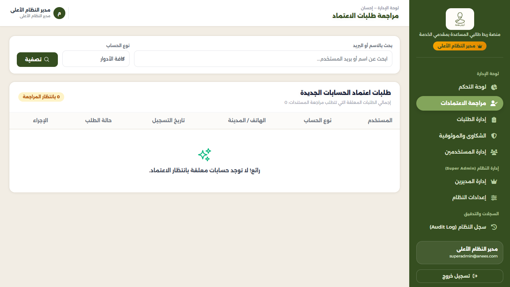

---

### 5.3 مراقبة الطلبات ومركز الشكاوى

| مراقبة كافة طلبات المنصة (`/admin/requests`) | مركز البلاغات والشكاوى (`/admin/complaints`) |
| :---: | :---: |
| 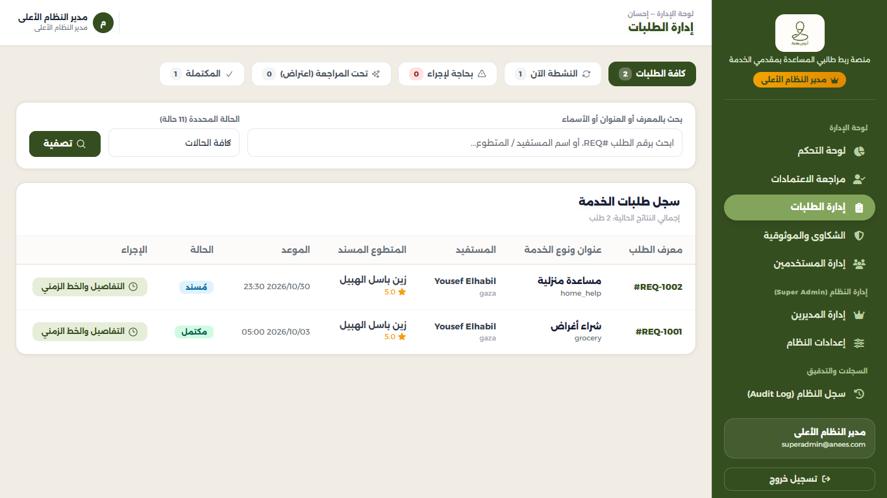 | 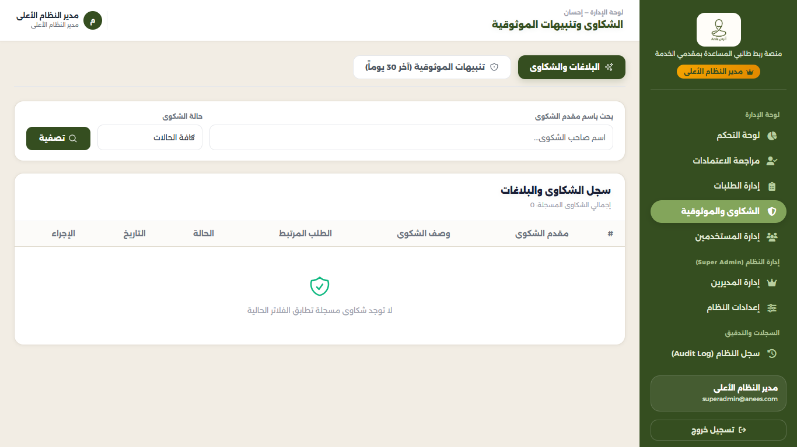 |

---

### 5.4 إدارة المستخدمين وسجلات التدقيق والإعدادات

| إدارة الحسابات وتعديل الأدوار (`/admin/users`) | إعدادات النظام وعتبات الترقية (`/admin/settings`) |
| :---: | :---: |
| 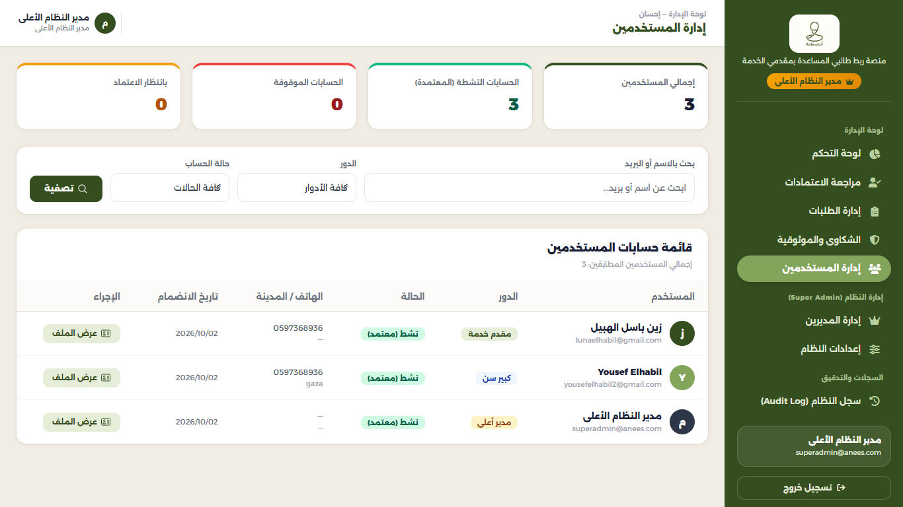 | 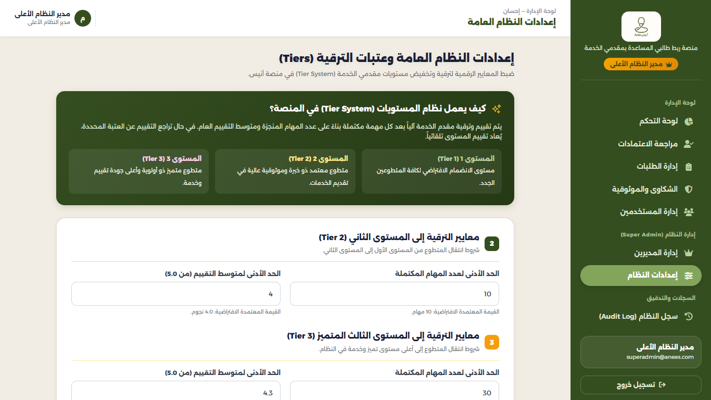 |

---

## 6. المسارات الاستثنائية والطارئة (Edge & Exception Flows)

هنا تجد التوثيق الدقيق لكافة الحالات غير الاعتيادية وما يفعله النظام عند وقوعها:

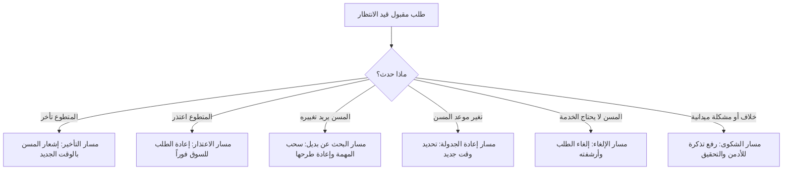
```mermaid
flowchart TD
    ReqActive[طلب مقبول قيد الانتظار] --> Event{ماذا حدث؟}
    
    Event -->|المتطوع تأخر| DelayFlow[مسار التأخير: إشعار المسن بالوقت الجديد]
    Event -->|المتطوع اعتذر| ApologyFlow[مسار الاعتذار: إعادة الطلب للسوق فوراً]
    Event -->|المسن يريد تغييره| AltFlow[مسار البحث عن بديل: سحب المهمة وإعادة طرحها]
    Event -->|تغير موعد المسن| RescheduleFlow[مسار إعادة الجدولة: تحديد وقت جديد]
    Event -->|المسن لا يحتاج الخدمة| CancelFlow[مسار الإلغاء: إلغاء الطلب وأرشفته]
    Event -->|خلاف أو مشكلة ميدانية| ComplaintFlow[مسار الشكوى: رفع تذكرة للأدمن والتحقيق]
```

---

### أ) مسار التأخير في الحضور (Volunteer Delay Flow)
* **المشكلة:** واجه المتطوع ازدحاماً مرورياً أو ظرفاً طارئاً يمنعه من الوصول في الوقت المحدد.
* **خطوات المسار:**
  1. يدخل المتطوع على صفحته `/provider/tasks` ويضغط زر **«إبلاغ عن تأخير» (Report Delay)**.
  2. يحدد مدة التأخير المتوقعة (مثلاً 15 دقيقة، 30 دقيقة) ويكتب سبباً مختصراً.
  3. يقوم النظام تلقائياً بتحديث حالة الطلب إلى `provider_delayed`.
  4. يتم إرسال إشعار فوري وتنبيه لكبير السن: *"المتطوع سيتأخر بمقدار 20 دقيقة بسبب زحمة السير"*.
  5. كبير السن يظهر أمامه خياران: **الانتظار**، أو **طلب متطوع بديل** إذا كان التأخير طويلاً ولا يناسبه.

---

### ب) مسار الاعتذار بعد قبول المهمة (Apology & Re-queue Flow)
* **المشكلة:** قَبِل المتطوع الطلب، ثم حصل معه ظرف قاهر يمنعه كلياً من تقديم الخدمة.
* **خطوات المسار:**
  1. يضغط المتطوع على **«اعتذار عن المهمة» (Apologize)**.
  2. يطلب النظام منه كتابة سبب الاعتذار لتوثيقه في السجل الداخلي للموثوقية.
  3. ينفذ النظام المعاملة التالية فوراً:
     - فك ارتباط الطلب بالمتطوع الحالي (`provider_id = null`).
     - تسجيل هوية المتطوع كـ `previous_provider_id` لمنع ظهور نفس الطلب له مجدداً.
     - إعادة حالة الطلب فوراً إلى `pending_acceptance` (متاح للقبول).
     - إشعار كبير السن: *"اعتذر المتطوع لظرف طارئ، وجاري إعادة توجيه طلبك لمتطوع آخر فوراً"*.
  4. يظهر الطلب تلقائياً في قائمة الطلبات المتاحة لباقي المتطوعين دون الحاجة لأن يعيد كبير السن كتابته.

---

### ج) مسار طلب متطوع بديل (Search Alternative Provider)
* **المشكلة:** المتطوع تأخر كثيراً أو لم يتجاوب مع الاتصال، ويريد كبير السن استبداله.
* **خطوات المسار:**
  1. من صفحة `/requests` لدى كبير السن، يضغط على الطلب ويختار **«البحث عن متطوع بديل»**.
  2. يسأله النظام للتأكيد، ثم يقوم بسحب المهمة من المتطوع الحالي.
  3. يتم تسجيل تنبيه للمتطوع الأول وتعديل سجله، ويُعاد طرح الطلب كطلب عاجل في سوق الطلبات المتاحة.

---

### د) مسار إعادة الجدولة (Reschedule Request)
* **المشكلة:** طرأ موعد مفاجئ لكبير السن ويرغب في تغيير موعد الزيارة أو شراء الدواء.
* **خطوات المسار:**
  1. يضغط كبير السن على زر **«إعادة جدولة»** بجانب طلبه.
  2. يختار اليوم والوقت الجديد المطلوب.
  3. إذا كان الطلب مسنداً لمتطوع، يصله إشعار بالموعد الجديد مع خيار (قبول الموعد الجديد أو الاعتذار ليتولاه غيره).

---

### هـ) مسار إلغاء الطلب (Cancellation Flow)
* **القواعد البرمجية للإلغاء:**
  - **إذا كان الطلب في حالة `pending_acceptance` (لم يقبله أحد بعد):** يحق للمسن إلغاؤه فوراً بضغطة زر دون أي تبعات.
  - **إذا كان الطلب في حالة `accepted` (قبله متطوع):** يمكن للمسن إلغاؤه مع كتابة سبب الإلغاء، ويصل إشعار فوري للمتطوع بإلغاء المشوار.
  - **إذا بدأ المتطوع الخدمة `in_progress`:** لا يمكن الإلغاء مباشرة إلا بالتواصل أو رفع بلاغ للإدارة حفاظاً على حقوق المتطوع الذي وصل للمكان بالفعل.

---

### و) مسار الإبلاغ عن مشكلة والشكاوى (Dispute & Complaint Resolution)
* **حالات الحدوث:**
  - **من طرف كبير السن:** المتطوع طلب مقابلاً مالياً وهو تطوعي، أو لم يلتزم بالاحترام، أو لم يُكمل المهمة.
  - **من طرف المتطوع:** العنوان غير صحيح، أو لا يوجد أحد في المنزل، أو تعرض لإساءة.
* **خطوات المسار:**
  1. يضغط الطرف المتضرر على زر **«إبلاغ عن مشكلة / شكوى»**.
  2. يحدد نوع الشكوى ويكتب التفاصيل ويرفق صوراً أو مستندات إذا تطلب الأمر.
  3. يتم إنشاء تذكرة نزاع تلقائياً برقم فريد وتظهر فوراً في لوحة الإدارة تحت مسار `/admin/complaints`.
  4. تتولى الإدارة التحقيق:
     - التواصل هاتفياً مع الطرفين المسجلين في النظام.
     - اتخاذ الإجراء المناسب من شاشة الشكاوى:
       * **تسوية ودية وحل الشكوى (`Resolved`).**
       * **توجيه إنذار رسمي للمتطوع أو خفض نقاط التزامه.**
       * **تجميد حساب المخالف فورياً (`Suspended`)** إذا كانت المخالفة أمنية جسيمة.

---

### ز) مسار رفض أو تعليق الحساب (Rejection & Suspension Flow)
* **المشكلة:** المتطوع رفع صورة هوية غير واضحة، أو خالف الشروط.
* **خطوات المسار:**
  1. من لوحة `/admin/approvals` أو `/admin/users`، يختار الأدمن خيار **«رفض الحساب»** أو **«تجميد»**.
  2. يدخل الأدمن سبب الرفض أو التعليق (مثل: *«يرجى رفع صورة الهوية بالوجهين وبشكل واضح»*).
  3. عندما يحاول المستخدم تسجيل الدخول، يوجهه النظام لشاشة إشعار بحالة حسابه مع إظهار سبب الرفض وزر لإعادة رفع المستندات المطلوبة للتصحيح.

---

## 7. جدول مطابقة المسارات البرمجية (Routes & Permissions Matrix)

| المسار البرمجي (Route URI) | اسم المسار في الكود (Named Route) | الصلاحية المطلوبة (Middleware) | الوظيفة الأساسية |
| :--- | :--- | :--- | :--- |
| `/login` | `login` | `guest` | تسجيل دخول كبار السن والمتطوعين |
| `/admin/login` | `admin.login` | `guest` | تسجيل دخول منفصل لمدراء النظام |
| `/register` | `register.choose` | `guest` | شاشة اختيار نوع الحساب |
| `/frontend/elderly/register` | `frontend.elderly.register` | `guest` | تسجيل كبير سن جديد |
| `/frontend/volunteer/register` | `frontend.volunteer.register` | `guest` | تسجيل متطوع جديد |
| `/dashboard` | `dashboard` | `auth, verified, role:elder` | الشاشة الرئيسية لكبير السن والمساعد الصوتي |
| `/requests` | `service-requests.index` | `auth, verified, role:elder` | متابعة وإدارة طلبات كبير السن |
| `/requests` (POST) | `service-requests.store` | `auth, verified, role:elder` | حفظ طلب مساعدة جديد في النظام |
| `/requests/{id}/cancel` | `service-requests.cancel` | `auth, verified, role:elder` | إلغاء الطلب |
| `/requests/{id}/confirm` | `service-requests.confirm` | `auth, verified, role:elder` | تأكيد اكتمال الخدمة والتقييم |
| `/requests/{id}/reschedule` | `service-requests.reschedule` | `auth, verified, role:elder` | تعديل موعد الطلب |
| `/requests/{id}/search-alternative` | `service-requests.search-alternative` | `auth, verified, role:elder` | سحب الطلب والبحث عن متطوع بديل |
| `/requests/{id}/report-problem` | `service-requests.report-problem` | `auth, verified` | رفع شكوى على الطلب |
| `/provider/dashboard` | `provider.dashboard` | `auth, verified, role:provider` | لوحة تحكم المتطوع |
| `/provider/available` | `provider.available` | `auth, verified, role:provider` | تصفح وقبول المهام المتاحة |
| `/provider/tasks` | `provider.tasks` | `auth, verified, role:provider` | قائمة مهام المتطوع الجارية |
| `/provider/tasks/{id}/accept` | `provider.tasks.accept` | `auth, verified, role:provider` | قبول المهمة وقفلها |
| `/provider/tasks/{id}/start-service` | `provider.tasks.start-service` | `auth, verified, role:provider` | بدء تنفيذ الخدمة ميدانياً |
| `/provider/tasks/{id}/finish-service`| `provider.tasks.finish-service`| `auth, verified, role:provider` | إنهاء الخدمة وطلب التأكيد |
| `/provider/tasks/{id}/report-delay` | `provider.tasks.report-delay` | `auth, verified, role:provider` | إبلاغ المسن بتأخير الوصول |
| `/provider/tasks/{id}/apologize` | `provider.tasks.apologize` | `auth, verified, role:provider` | اعتذار المتطوع وإعادة الطلب للسوق |
| `/provider/performance` | `provider.performance` | `auth, verified, role:provider` | سجل أداء وساعات وتقييمات المتطوع |
| `/provider/certificates` | `provider.certificates` | `auth, verified, role:provider` | طلب شهادة خبرة بساعات التطوع |
| `/admin/dashboard` | `admin.dashboard` | `auth, ensure.admin` | لوحة الإحصائيات المركزية للإدارة |
| `/admin/approvals` | `admin.approvals.index` | `auth, ensure.admin` | تدقيق واعتماد وثائق المتطوعين |
| `/admin/requests` | `admin.requests.index` | `auth, ensure.admin` | مراقبة حية لجميع طلبات المنصة |
| `/admin/complaints` | `admin.complaints.index` | `auth, ensure.admin` | مركز معالجة الشكاوى والنزاعات |
| `/admin/users` | `admin.users.index` | `auth, ensure.admin` | إدارة حسابات وتجميد المستخدمين |
| `/admin/audit-logs` | `admin.audit-logs.index` | `auth, ensure.admin` | سجل التدقيق والرقابة الأمنية |
| `/admin/settings` | `admin.settings.index` | `auth, ensure.admin` | إعدادات النظام وعتبات الترقية |

---
**تم إعداد هذا التوثيق ليكون مرجعاً هندسياً وتشغيلياً متكاملاً لمنصة أنيس 2026.**
